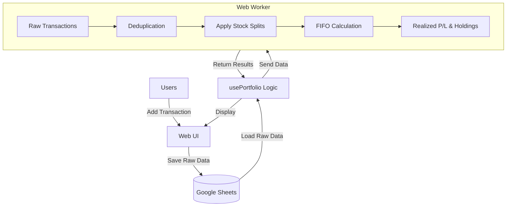

# Invest-Tracker Portfolio System

ระบบจัดการพอร์ตหุ้นอัจฉริยะที่ใช้ Google Sheets เป็น Database แต่ทำการคำนวณทั้งหมดแบบ Local เพื่อความรวดเร็วและปลอดภัย

## 🚀 Features (ฟีเจอร์หลัก)

### 📊 Dashboard
- สรุปกำไร/ขาดทุนรวม (Realized P/L + Dividends)
- แสดงมูลค่าพอร์ตแยกตามหมวดหมู่
- รองรับสกุลเงิน THB และ USD

### 📈 Investment Analytics (วิเคราะห์การลงทุน)
- **สรุปรายปี**: ตาราง + กราฟแท่งแสดงกำไร/ปันผลแต่ละปี
- **ตัวกรองช่วงเวลา**: เลือกดูข้อมูลเฉพาะช่วงเวลาที่ต้องการ
- **พยากรณ์การเติบโต**: คำนวณ Compound Growth ระบุ % และจำนวนปีได้

### 🔄 Data Management
- **FIFO Calculation**: คำนวณ P/L ตามลำดับซื้อก่อน-ขายก่อน
- **Stock Split Support**: ปรับราคา/หุ้นย้อนหลังอัตโนมัติ
- **Deduplication**: ตรวจจับและลบข้อมูลซ้ำอัตโนมัติ
- **Manual P/L Override**: กำหนดกำไร/ขาดทุนเองได้เมื่อ FIFO ไม่ตรง
- **Bulk Delete by ID**: ลบหลายรายการพร้อมกันด้วย ID

### 💾 Data Storage
- **Google Sheets**: เก็บข้อมูลดิบ (Raw Data) บน Cloud
- **Offline Support**: ทำงานได้โดยไม่ต้องเชื่อมต่อ (PWA)
- **Auto Sync**: ซิงค์อัตโนมัติเมื่อกลับมาออนไลน์

---

## 🏗 System Architecture



---

## 📁 Project Structure

```
src/
├── pages/
│   ├── Index.tsx              # หน้าหลัก Dashboard
│   ├── AnalyticsPage.tsx      # หน้าวิเคราะห์การลงทุน
│   └── CategoryPage.tsx       # รายละเอียดแต่ละหมวด
│
├── components/
│   ├── portfolio/
│   │   ├── DimeLayout.tsx     # Layout หลักของ Dashboard
│   │   ├── TransactionList.tsx # รายการซื้อขาย
│   │   ├── TransactionEditDialog.tsx # แก้ไขรายการ
│   │   └── HoldingCard.tsx    # การ์ดแสดงหุ้นแต่ละตัว
│   │
│   └── analytics/
│       ├── YearlySummary.tsx  # ตารางสรุปรายปี
│       ├── DateRangeFilter.tsx # ตัวกรองช่วงเวลา
│       └── GrowthProjection.tsx # พยากรณ์การเติบโต
│
├── hooks/
│   └── usePortfolio.ts        # State Management หลัก
│
├── lib/
│   └── portfolioCalculations.ts # ฟังก์ชันคำนวณรวม
│
├── services/
│   ├── sheetsService.ts       # Google Sheets API
│   ├── stockPriceService.ts   # ดึงราคาหุ้น Real-time
│   └── offlineStorage.ts      # เก็บข้อมูล Offline
│
├── workers/
│   └── portfolioWorker.ts     # Web Worker คำนวณ P/L
│
├── contexts/
│   └── AuthContext.tsx        # Google OAuth
│
└── types/
    └── portfolio.ts           # TypeScript Types
```

---

## 🧮 Calculation Logic

### 1. Stock Split Adjustment
ก่อนคำนวณ P/L ระบบจะปรับข้อมูลย้อนหลังตามการแตกหุ้น:
- Transaction ก่อนวันแตกหุ้น: `shares *= ratio`, `price /= ratio`
- ไม่แก้ไขข้อมูลจริงใน Sheets (ปรับใน Memory เท่านั้น)

### 2. FIFO Calculation
1. เรียงรายการตามเวลา (เก่า → ใหม่)
2. **Buy**: เพิ่มเข้า Inventory `{ shares, costPerShare, remaining }`
3. **Sell**: ตัดจาก Inventory ตาม FIFO
4. **P/L**: `(ราคาขาย - ต้นทุนล็อต) × จำนวนที่ขาย`

### 3. Manual P/L Override
ถ้า FIFO คำนวณผิด (เช่น ข้อมูลเดิมไม่ครบ):
- แก้ไขรายการ → ใส่ค่า "กำไร/ขาดทุน (กำหนดเอง)"
- ระบบจะใช้ค่าที่กำหนดแทนการคำนวณอัตโนมัติ

---

## 🛠 Development

```bash
# Install dependencies
npm install

# Start dev server
npm run dev

# Build for production
npm run build
```

---

## 📝 Notes

- **Data Integrity**: ระบบตรวจจับ Duplicate by ID อัตโนมัติ
- **Cache**: มี Cache 5 นาทีสำหรับ API calls (ใช้ forceRefresh เมื่อโหลดใหม่)
- **Price Providers**: Yahoo Finance + CoinGecko (fallback)
