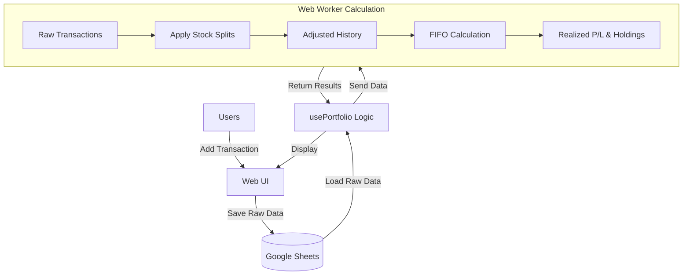

# Invest-Tracker Portfolio System

ระบบจัดการพอร์ตหุ้นอัจฉริยะที่ใช้ Google Sheets เป็น Database แต่ทำการคำนวณทั้งหมดแบบ Local เพื่อความรวดเร็วและปลอดภัย

## 🏗 System Architecture (สถาปัตยกรรมระบบ)

ระบบได้รับการออกแบบใหม่ให้เป็น **"Read-Only Sheets Architecture"** สำหรับการคำนวณ
- **Google Sheets**: ทำหน้าที่เก็บข้อมูลดิบ (Raw Data) เท่านั้น (รายการซื้อขาย, การแตกหุ้น)
- **Application**: โหลดข้อมูลดิบมาเก็บไว้ใน Memory และคำนวณกำไร/ขาดทุน (P/L) ภายในเครื่อง (Local)
- **Web Worker**: ทำหน้าที่คำนวณประมวลผลหนัง (FIFO P/L, Stock Splits) เพื่อไม่ให้หน้าเว็บค้าง

---

## 💻 Code Flow Diagram

### 1. Data Loading (`usePortfolio.ts`)
เมื่อเปิดแอปหรือกด Refresh:
1. `checkSession`: ตรวจสอบ Login (Google OAuth)
2. `loadData`: 
   - โหลด **Transactions** จาก Sheet "Transactions"
   - โหลด **Stock Splits** จาก Sheet "Config"
   - **Deduplicate**: ตัดข้อมูลซ้ำหากมีการ Save ซ้อนกัน
3. ส่งข้อมูลทั้งหมดไปคำนวณใหม่ที่ `recalculateHistory`

### 2. Calculation Engine (`portfolioWorker.ts`)
หัวใจสำคัญของการคำนวณทำงานใน Background Thread:

#### A. Stock Split Application
ก่อนคำนวณกำไร ระบบจะปรับปรุงข้อมูลย้อนหลังตามการแตกหุ้น (Stock Split) โดย **ไม่แก้ไขข้อมูลจริงใน Sheets**
- **Logic**: ถ้า Transaction เกิดก่อนวันที่แตกหุ้น (`effectiveDate`)
  - `New Shares` = `Old Shares` * Ratio
  - `New Price`  = `Old Price` / Ratio
- ทำให้ต้นทุนเฉลี่ยและจำนวนหุ้นถูกต้องตามปัจจุบัน

#### B. FIFO Pattern (First-In-First-Out)
ระบบคำนวณกำไร/ขาดทุนตามลำดับการซื้อขายจริง:
1. **Sort**: เรียงรายการตามลำดับเวลาเก่า -> ใหม่
2. **Buy**: เก็บเข้า "Inventory" (ล็อตหุ้น)
   - แต่ละล็อตเก็บ: `{ shares, costPerShare, remaining }`
3. **Sell**: ตัดหุ้นออกจาก Inventory ตามลำดับก่อน-หลัง (FIFO)
   - `Realized P/L` = (ราคาขาย - ต้นทุนของล็อตที่ถูกตัด) * จำนวนที่ขาย
   - ถ้าขายหุ้นที่มีการแตกหุ้น ต้นทุนก็จะถูกปรับลดลงแล้วจากขั้นตอน A ทำให้ P/L ถูกต้อง

### 3. Data Saving (`sheetsService.ts`)
การบันทึกข้อมูลจะทำเมื่อ User กดเพิ่มรายการเท่านั้น:
- **Append Only**: เพิ่มบรรทัดใหม่ต่อท้ายเสมอ
- **Config Sheet**: เก็บข้อมูล Metadata เช่น Stock Splits
- **Protection**: มีระบบ Lock (`findOrCreateSpreadsheet`) เพื่อป้องกันการสร้างไฟล์ซ้ำซ้อน

---

## � File Structure

- `src/hooks/usePortfolio.ts` -> **Main Logic**: จัดการ State, โหลดข้อมูล, สั่งคำนวณ
- `src/services/sheetsService.ts` -> **API Layer**: คุยกับ Google Sheets API (Read/Write)
- `src/workers/portfolioWorker.ts` -> **Calculator**: โค้ดคำนวณ P/L และ Stock Split
- `src/contexts/AuthContext.tsx` -> **Auth**: จัดการ Login/Token
- `src/components/portfolio/*` -> **UI**: แสดงผลกราฟและรายการ

## � How to Verify Calculations

หากต้องการตรวจสอบความถูกต้อง:
1. **Transactions Sheet**: ดูข้อมูลดิบว่ามีการซื้อขายครบถ้วน
2. **Settings -> Stock Splits**: ตรวจสอบว่ามีประวัติการแตกหุ้นถูกต้อง (วันที่/อัตราส่วน)
3. **Debug Mode**:
   - กด F12 เปิด Console
   - ดู Log: `"Recalculate P/L with X transactions"`
   - สังเกตค่า `realizedPL` ในหน้า UI ว่าตรงกับที่คำนวณมือหรือไม่ (โดยเฉพาะหลังแตกหุ้น)
